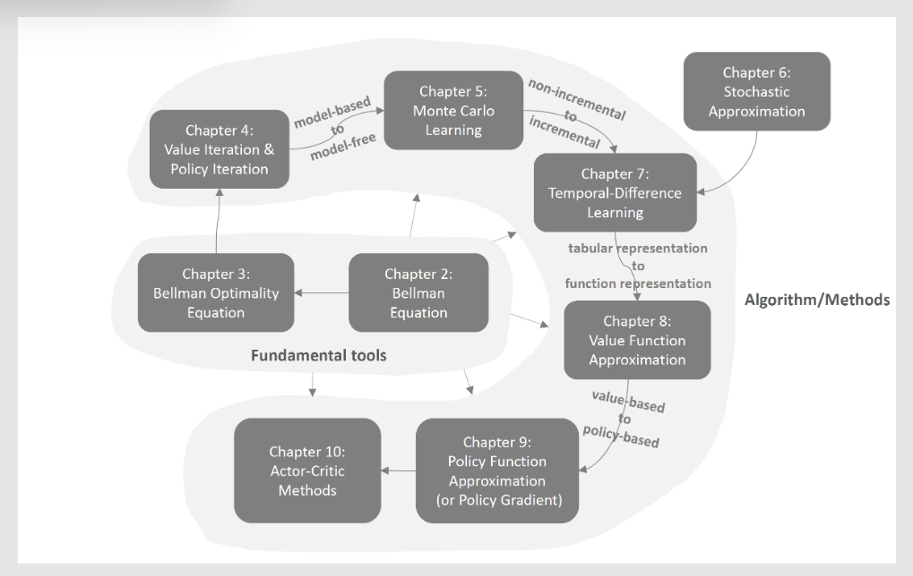

# Mathematical Foundation of Reinforcement Learning

## outline

## note

[Lecture 0: Introduction](docs/lec0-introduction.md)

[Lecture 1: Basic Concepts](docs/lec1-basic-concepts.md)

[Lecture 2: Bellman Equation](docs/lec2-bellman-equation.md)

[Lecture 3: Bellman Optimality Equation](docs/lec3-BOE.md)

[Lecture 4: Value Iteration and Policy Iteration](docs/lec4-value&policy-iteration.md)

[Lecture 5: Monte Carlo Learning](docs/lec5-monte-carlo-learning.md)

[Lecture 6: SA and SGD](docs/lec6-SA&SGD.md)

[Lecture 7: Temporal Difference Learning](docs/lec7-temporal-difference.md)

[Lecture 8: Value Function Approximation](docs/lec8-value-function-approx.md)

[Lecture 9: Policy Gradient](docs/lec9-policy-gradient.md)

[Lecture 10: Actor Critic](docs/lec10-actor-critic.md)
