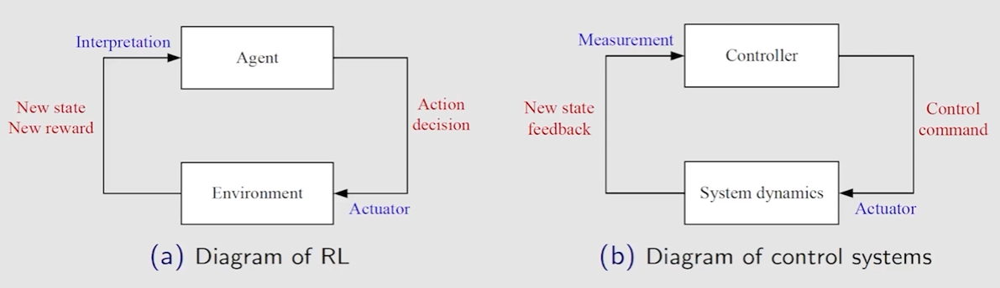

# Introduciton

## Why this course?

Books (computer science perspective):

* R.S Sutton and A.G.Barto, Reinforcement learning: An introduction. MIT Press, 1998/2008. 强化学习领域的圣经，但未必适合入门，文字性描述比较多
* C. Szepesvari, Algorithms for Reinforcement learning. Morgan and Claypool Publishers, 2010. 一本短小精悍的小册子

Features of reinforcement learning:

* Mathematical
* Systematic

Let math talk: Math $\Rightarrow$ Intution, but Intution $\nRightarrow$ Math

This course introduces RL topics from a mathematical point of view. There are many instructive examples.

For this course, you need: You want to understand the RL topics thoroughly, not just programming.

## The story of AlphaGo

* Jan 2016, Nature
* Mar 2016, Beat Lee Sedol (4:1)
* Dec 2016, Master (AlphaGo) started playing online, 60:0
* May 2017, Beat Ke Jie (3:0)
* Oct 2017, AlphaZero beat AlphaGo (100:0)

## Brief history of RL

Breakline between classic RL and deep RL: **Deep Q-Learning**

* Q-learning, 1989
* Temporal-difference learning, 1988
* Dynamic programming, 1957

Classification of RL

* Artificial intelligence
  * Machine learning
    * Supervised learning
    * Unsupervied learning
    * Reinforcement learning

