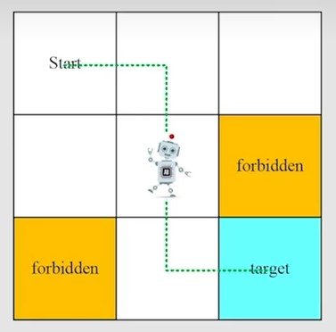

# Basic Concepts in Reinforcement Learning

## A grid-world example

An illustrative example used throughout this course:

* Grid of cells: Accessible/forbidden/target cells, boundary.
* Very easy to understand and for illustration

Task:

* Given any starting area, find a "good" way to the target.
* How to define "good"? Avoid forbidden cells, detours, or boundary.

## State

State: The status of the agent with respect to the environment.

> for the grid-world example, the location of the agent is the state

From left to right, from up to down, the grids are marked $s_1,\dots, s_9$

State space: the set of all states $\mathcal S = \{s_i\}_{i=1}^9$

## Action

Action: For each state, there are five possible actions

* $a_1$ : move upwards;
* $a_2$ : move rightwards;
* $a_3$ : move downwards;
* $a_4$ : move leftwards;
* $a_5$ : stay unchanged;

Actions space of a state: the set of all possible of a state.

$$
\mathcal{A}(s_i) = \{a_i\}_{i=1}^5
$$

## State transition

When taking an action, the agent may move from one state to another. Such a process is called *state transition*

State transition defines the interaction with the environment

Tabular representation: We can use a table to describe the state transition.
But only represent deterministic cases.

State transition probability: use probability to describe state transition.

* Intution: At state $s_1$ , if we choose action $a_2$ , the next state is $s_2$
* Math:

$$
\begin{align}
\nonumber & p(s_2|s_1, a_2) = 1 \\
\nonumber & p(s_i|s_1, a_2) = 0 \quad \forall i \ne 2
\end{align}
$$

The state transition could be stochastic.

## Policy

Policy tells the agent what actions to take at a state.

Mathematical representation: using conditional probability

For example, for state $s_1$ :

$$
\pi(a_1|s_1) = 0 \\
\pi(a_2|s_1) = 1 \\
\pi(a_3|s_1) = 0 \\
\pi(a_4|s_1) = 0 \\
\pi(a_5|s_1) = 0 \\
$$

It's a deterministic policy.
There are stochastic policies.

$$
\pi(a_1|s_1) = 0 \\
\pi(a_2|s_1) = 0.5 \\
\pi(a_3|s_1) = 0.5 \\
\pi(a_4|s_1) = 0 \\
\pi(a_5|s_1) = 0 \\
$$

Tabular representation of a policy.

## Reward

Reward: a real number we get after taking an action.

* A positive reward represents encouragement to take such actions.
* A negetive reward represents punishment to take such actions.

> In the grid-world example, the rewards are designed as follows:
>
> * if the agent attempts to get out of the boundary, let $r_{bound} = -1$
> * if the agent attempts to center a forbidden cell, let $r_{forbid} = -1$
> * if the agent reaches the target cell, let $r_{target} = 1$
> * otherwise, the agent gets a reward of $r=0$

Reward can be interpreted as a **human-machine interface**, with which we can guide the agent to behave as what we expect.

We can use tabular representation to represent reward. deterministic cases.

Mathematical description: conditional probability

* Intution: At state $s_1$, if we choose action $a_1$, the reward is $-1$
* Math: $p(r=1|s_1, a_1) = 1 \quad and \quad  p(r\ne -1|s_1, a_1) = 0$

## Trajectory and return

A **trajectory** is a state-action-reward chain

$$
s_1 \xrightarrow[r=0]{a_2} s_2 \xrightarrow[r=0]{a_3} s_5 \xrightarrow[r=0]{a_3} s_8 \xrightarrow[r=1]{a_2} s_9
$$

The return of the trajectory is the sum of all the rewards collected along the trajectory:

$$
\mathrm{return} = 0+0+0+1 = 1
$$

**Which policy is better?**

* Mathematics: it has a greater return
* Return could be used to evaluate whether a policy is good or not

## Discounted return

Need to introduce **discounted rate** $\gamma \in [0, 1)$

Discounted rate:

$$
\mathrm{discounted\ return}= r_0 + \gamma r_1 + \gamma^2 r_2 + \dots
$$

Roles:

1. the sum become finite;
2. balance the far and near future rewards

* if $\gamma$ is close to 0, the value of the discounted return is dominated by the rewards obtained in the near future.
* if $\gamma$ is close to 1, the value of the discounted return is dominated by the rewards obtained in the far future.

## Episode

When interacting with the environment following a policy, the agent may stop some terminal state. The resulting trajectory is called a episode (or a trial).

An episode is usually assumed to be a **finite trajectory**.

Tasks with episodes are called *episodic tasks*.

Some tasks may have no teminal states, meaning the interaction with the environment will never end. Such tasks are called *continuing tasks*

## Markov decision process (MDP)

Key elements of MDP:

* Sets
  * State: the set of states $\mathcal{S}$
  * Action: the set of actions $\mathcal{A}(s)$ is associated for state $s \in \mathcal{S}$
  * Reward: the set of rewards $\mathcal{R}(s, a)$
* Probability distribution
  * State transition probability: at state $s$ , taking action $a$ , the probability to transit to $s'$ is $p(s'|s, a)$
  * Reward probability: at state $s$, taking action $a$ , the probability to get reward $r$ is $p(r|s, a)$
* Policy: at state $s$, the probability to choose action $a$ is $\pi(a|s)$
* Markov property: memoryless property

$$
p(s_{t+1}|a_{t+1}, s_t, \dots , a_1, s_0) = p(s_{t+1}|a_{t+1}, s_t) \\
p(r_{t+1}|a_{t+1}, s_t, \dots , a_1, s_0) = p(r_{t+1}|a_{t+1}, s_t)
$$
